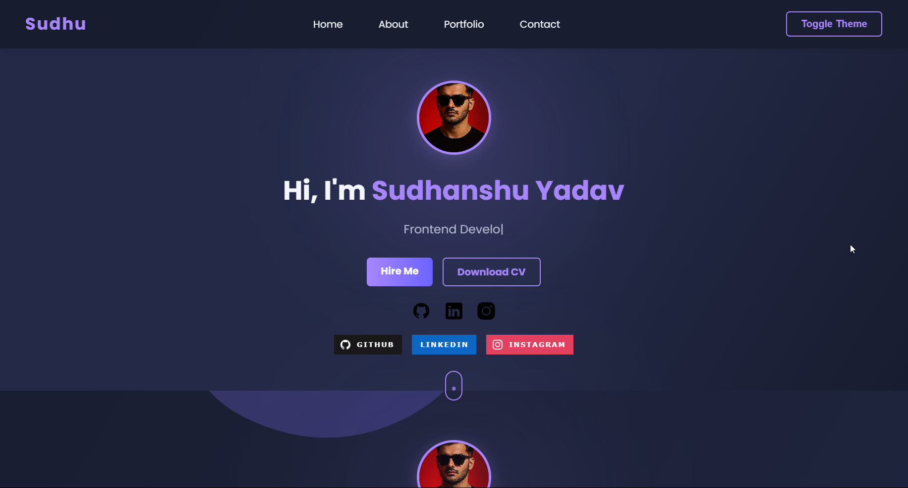

# 🌐 Personal Portfolio – Sudhanshu Yadav

Welcome to my **personal portfolio website**, a dynamic and responsive web profile to showcase my projects, skills, and passion for technology.

🚀 **Live Preview**: [Click Here](https://heysudhuu.github.io/my-portfolio/)

---

## 📁 About

This website serves as my digital resume and project showcase. Built using modern web technologies, it is lightweight, fast, and mobile-friendly. It reflects my passion for **cybersecurity**, **full stack development**, and continuous learning.

---

## 💡 Features

- 📄 Clean and responsive layout
- 💼 Project showcases with links
- 📧 Contact section
- 🌙 Dark/light theme (optional if implemented)
- ⚡ Fast loading and fully responsive

---

## 🛠️ Built With

- HTML5
- CSS3
- JavaScript (Vanilla)
- Git & GitHub Pages for deployment

---

## 🖼️ Screenshot



---

## 📦 Setup Instructions

1. Clone the repository:
```bash
   git clone https://github.com/heysudhuu/my-portfolio.git

```

2. Open the folder:
```bash
cd my-portfolio
```
3.Open index.html in your browser or host it via GitHub Pages / Netlify.

👨‍💻 Author
Sudhanshu Yadav

🔗 GitHub(https://heysudhuu.github.io/my-portfolio/)

💼 LinkedIn([](https://www.linkedin.com/in/heysudhu))

📧 py7716496@gmail.com

📃 License
This project is open-source and available under the MIT License.

Designed & developed with ❤️ by Sudhanshu Yadav
```yaml


---

### ✅ To Use:
1. Save this content in a file named `README.md`.
2. Place it in the root of your GitHub repo (`my-portfolio`).
3. Add and push it:

```bash
git add README.md
git commit -m "Add professional README"
git push origin main
```
